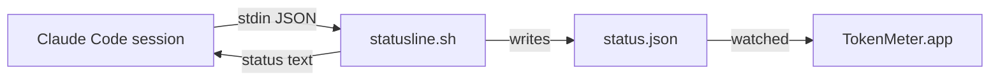

# TokenMeter

A macOS menu bar app that shows how much of your Claude Code
subscription rate limit you've used — the 5-hour session window and
the 7-day weekly window — and how much is left, at a glance.

## How it works

Claude Code has an officially documented `statusLine` hook: a command
it invokes with a JSON payload on every status-line render, including
`rate_limits.five_hour` / `rate_limits.seven_day` usage percentages.
TokenMeter installs a small script as that hook, which writes a JSON
snapshot to disk; the menu bar app watches that file and renders it.
No network calls, no OAuth/Keychain access — everything is local.



**Caveat:** the hook only fires while a Claude Code session is
actively rendering its status line. When no session is open, the app
shows the last known value, dimmed, with an "updated Nm ago" label —
it never invents a number. `rate_limits` only appears for Claude.ai
subscription plans (Pro/Max), not pay-per-token API key usage.

## Install

Requires macOS 13+ and [`jq`](https://jqlang.org) (`brew install jq`).

1. Download the latest `TokenMeter.app` from
   [Releases](../../releases) (or build from source, below) and move it
   to `/Applications`.
2. Open it. Click the menu bar item, then **Repair hook** — this adds a
   `statusLine` entry to `~/.claude/settings.json` (backing up the
   original first) pointing at TokenMeter's script.
3. Start (or continue) a Claude Code session and send a message. Within
   a few seconds, the menu bar should show real percentages.

If you already have a custom `statusLine` configured, TokenMeter wraps
it instead of replacing it — your existing status line keeps working,
with TokenMeter's data collection layered on top.

## Uninstall

TokenMeter backs up `~/.claude/settings.json` before every install, as
`~/.claude/tokenmeter/settings.json.bak-<timestamp>`. To revert: copy
the most recent backup back over `~/.claude/settings.json`, then delete
`TokenMeter.app` and `~/.claude/tokenmeter/`.

```bash
cp ~/.claude/tokenmeter/settings.json.bak-* ~/.claude/settings.json  # pick the latest if there are several
rm -rf ~/.claude/tokenmeter
```

## Build from source

```bash
git clone https://github.com/sh4r11f/tokenmeter.git
cd tokenmeter
swift test                # run the TokenMeterCore unit tests
./scripts/test-statusline.sh   # run the shell hook's tests
./scripts/build-app.sh    # produces dist/TokenMeter.app
open dist/TokenMeter.app
```

## Architecture

See [`docs/superpowers/specs/2026-08-17-tokenmeter-design.md`](docs/superpowers/specs/2026-08-17-tokenmeter-design.md)
for the full design, including error handling and the settings.json
merge/backup logic.

## License

MIT — see [LICENSE](LICENSE).
