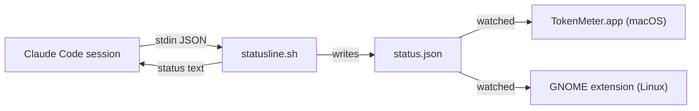

# TokenMeter

Shows how much of your Claude Code subscription rate limit you've used —
the 5-hour session window and the 7-day weekly window — and how much is
left, at a glance:

- **macOS**: a menu bar app.
- **Linux**: a GNOME Shell top-bar extension.

## How it works

Claude Code has an officially documented `statusLine` hook: a command
it invokes with a JSON payload on every status-line render, including
`rate_limits.five_hour` / `rate_limits.seven_day` usage percentages.
TokenMeter installs a small script as that hook, which writes a JSON
snapshot to disk; the platform UI watches that file and renders it.
No network calls, no OAuth/Keychain access — everything is local.



**Caveat:** the hook only fires while a Claude Code session is
actively rendering its status line. When no session is open, the UI
shows the last known value, dimmed, with an "updated Nm ago" label —
it never invents a number. `rate_limits` only appears for Claude.ai
subscription plans (Pro/Max), not pay-per-token API key usage.

## Install (macOS)

Requires macOS 13+ and [`jq`](https://jqlang.org) (`brew install jq`).

1. Download the latest `TokenMeter.app` from
   [Releases](../../releases) (or build from source, below) and move it
   to `/Applications`.
2. Open it. Click the menu bar item, then **Repair hook** — this adds a
   `statusLine` entry to `~/.claude/settings.json` (backing up the
   original first) pointing at TokenMeter's script.
3. Start (or continue) a Claude Code session and send a message. Within
   a few seconds, the menu bar should show real percentages.

## Install (Linux)

Requires [`jq`](https://jqlang.org) (`sudo apt install jq`) and, for the
top-bar UI, GNOME Shell 48+ (Ubuntu 24.10+, Fedora 40+). Everything is
per-user — no sudo needed for the install itself.

```bash
git clone https://github.com/sh4r11f/tokenmeter.git
cd tokenmeter
./linux/install.sh
```

The installer sets up the `statusLine` hook (same backup/merge behavior
as macOS) and installs the GNOME extension. On Wayland, a newly
installed extension loads at your next login — the installer marks it
enabled and tells you if a log-out/log-in is needed. Then send a message
in any Claude Code session and the top bar shows real percentages.

On a non-GNOME desktop, run `./linux/install.sh --no-extension`: you
still get usage percentages in the terminal status line of every
Claude Code session.

If you already have a custom `statusLine` configured, TokenMeter wraps
it instead of replacing it — your existing status line keeps working,
with TokenMeter's data collection layered on top. This applies on both
platforms.

## Uninstall

**Linux:**

```bash
~/.claude/tokenmeter/uninstall.sh          # keeps snapshots + settings backups
~/.claude/tokenmeter/uninstall.sh --purge  # removes those too
```

This surgically removes TokenMeter's `statusLine` entry (restoring a
wrapped pre-existing command exactly) and removes the extension —
settings changes you made after installing are untouched.

**macOS:** TokenMeter backs up `~/.claude/settings.json` before every
install, as `~/.claude/tokenmeter/settings.json.bak-<timestamp>`. To
revert: copy the most recent backup back over `~/.claude/settings.json`,
then delete `TokenMeter.app` and `~/.claude/tokenmeter/`.

```bash
cp ~/.claude/tokenmeter/settings.json.bak-* ~/.claude/settings.json  # pick the latest if there are several
rm -rf ~/.claude/tokenmeter
```

## Build from source / run tests

```bash
git clone https://github.com/sh4r11f/tokenmeter.git
cd tokenmeter

# macOS
swift test                     # TokenMeterCore unit tests
./scripts/test-statusline.sh   # shell hook tests
./scripts/build-app.sh         # produces dist/TokenMeter.app
open dist/TokenMeter.app

# Linux (nothing to compile — bash + GJS)
./scripts/test-statusline.sh   # shell hook tests
./linux/test-install.sh        # installer merge/backup/unwrap tests
./linux/test-extension.sh      # extension schema/metadata + gjs unit tests
./linux/install.sh
```

## Architecture

- [`docs/superpowers/specs/2026-08-17-tokenmeter-design.md`](docs/superpowers/specs/2026-08-17-tokenmeter-design.md)
  — original design: data flow, error handling, and the settings.json
  merge/backup logic.
- [`docs/superpowers/specs/2026-08-26-linux-support.md`](docs/superpowers/specs/2026-08-26-linux-support.md)
  — Linux port: GNOME extension, installer/uninstaller, and the
  security/privacy hardening shared by both platforms.

## License

MIT — see [LICENSE](LICENSE).
