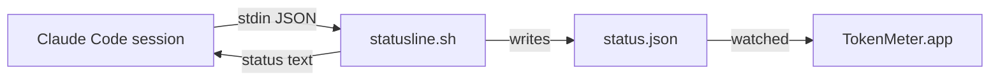

# TokenMeter Implementation Plan

> **For agentic workers:** REQUIRED SUB-SKILL: Use superpowers:subagent-driven-development (recommended) or superpowers:executing-plans to implement this plan task-by-task. Steps use checkbox (`- [ ]`) syntax for tracking.

**Goal:** Build a macOS menu bar app (TokenMeter) that shows Claude Code's 5-hour and 7-day subscription rate-limit usage, sourced from Claude Code's official `statusLine` hook, and publish it as a public GitHub repo.

**Architecture:** A shell script (`statusline.sh`) installed as Claude Code's `statusLine` command writes a small JSON snapshot to `~/.claude/tokenmeter/status.json` on every status-line render. A Swift Package Manager app watches that file and renders it in an `NSStatusItem` via SwiftUI's `MenuBarExtra`. Parsing, staleness, and settings.json editing logic live in a `TokenMeterCore` library target so they're unit-testable independent of the UI.

**Tech Stack:** Swift 5 (language mode, on the Swift 6.3 toolchain), Swift Package Manager, SwiftUI `MenuBarExtra` (macOS 13+), `ServiceManagement.SMAppService` for launch-at-login, `jq` in the shell hook, XCTest.

**Spec:** `docs/superpowers/specs/2026-08-17-tokenmeter-design.md`

## Global Constraints

- Minimum macOS 13.0 (`MenuBarExtra`, `SMAppService`).
- Build and test entirely via CLI (`swift build`, `swift test`) — no Xcode GUI.
- `TokenMeterCore` has zero AppKit/SwiftUI dependencies — every type in it must be testable with plain XCTest and no UI runtime.
- `settings.json` edits must never delete unrelated keys, and must always write a timestamped backup first.
- Nothing in this app makes network calls or reads OAuth/Keychain data.
- Never fail silently: unreadable/unwritable files and malformed JSON surface as explicit, typed errors or explicit UI states — never a swallowed exception.

---

### Task 1: Project scaffolding

**Files:**
- Create: `Package.swift`
- Create: `.gitignore`
- Create: `LICENSE`
- Create: `Sources/TokenMeterCore/.gitkeep` (removed once Task 2 adds real files)
- Create: `Sources/TokenMeter/main.swift` (placeholder, replaced in Task 7)
- Create: `Tests/TokenMeterCoreTests/.gitkeep` (removed once Task 2 adds real tests)

**Interfaces:**
- Produces: a package with library target `TokenMeterCore` and executable target `TokenMeter`, both buildable via `swift build`.

- [ ] **Step 1: Write `Package.swift`**

```swift
// swift-tools-version:5.10
import PackageDescription

let package = Package(
    name: "TokenMeter",
    platforms: [.macOS(.v13)],
    products: [
        .library(name: "TokenMeterCore", targets: ["TokenMeterCore"]),
        .executable(name: "TokenMeter", targets: ["TokenMeter"]),
    ],
    targets: [
        .target(name: "TokenMeterCore"),
        .executableTarget(name: "TokenMeter", dependencies: ["TokenMeterCore"]),
        .testTarget(name: "TokenMeterCoreTests", dependencies: ["TokenMeterCore"]),
    ]
)
```

- [ ] **Step 2: Write `.gitignore`**

```
.build/
.swiftpm/
dist/
*.xcuserstate
.DS_Store
```

- [ ] **Step 3: Write `LICENSE`**

Use the standard MIT license text, copyright line: `Copyright (c) 2026 Sharif Saleki`.

- [ ] **Step 4: Add placeholder sources so the package builds**

`Sources/TokenMeterCore/Placeholder.swift`:
```swift
// Replaced in Task 2.
public enum TokenMeterCorePlaceholder {}
```

`Sources/TokenMeter/main.swift`:
```swift
// Replaced in Task 7.
print("TokenMeter")
```

`Tests/TokenMeterCoreTests/PlaceholderTests.swift`:
```swift
import XCTest
@testable import TokenMeterCore

final class PlaceholderTests: XCTestCase {
    func testPlaceholder() {
        XCTAssertTrue(true)
    }
}
```

- [ ] **Step 5: Verify the package builds and tests run**

Run: `swift build && swift test`
Expected: both succeed, 1 test passes.

- [ ] **Step 6: Commit**

```bash
git add Package.swift .gitignore LICENSE Sources Tests
git commit -m "Scaffold TokenMeter Swift package"
```

---

### Task 2: Rate-limit data model and JSON decoding

**Files:**
- Create: `Sources/TokenMeterCore/RateLimitStatus.swift`
- Test: `Tests/TokenMeterCoreTests/RateLimitStatusTests.swift`
- Delete: `Sources/TokenMeterCore/Placeholder.swift`, `Tests/TokenMeterCoreTests/PlaceholderTests.swift`

**Interfaces:**
- Produces: `RateLimitWindow { usedPercentage: Double, resetsAt: Date }`, `RateLimits { fiveHour: RateLimitWindow?, sevenDay: RateLimitWindow? }`, `StatusSnapshot { capturedAt: Date, rateLimits: RateLimits? }`, all `Codable, Equatable`. Decoded from the JSON `statusline.sh` writes (see Task 6): `{"captured_at": <epoch seconds>, "rate_limits": {"five_hour": {"used_percentage": <double>, "resets_at": <epoch seconds>}, "seven_day": {...}} | null}`.

- [ ] **Step 1: Write the failing tests**

`Tests/TokenMeterCoreTests/RateLimitStatusTests.swift`:
```swift
import XCTest
@testable import TokenMeterCore

final class RateLimitStatusTests: XCTestCase {
    func testDecodesFullPayload() throws {
        let json = """
        {
          "captured_at": 1755460000,
          "rate_limits": {
            "five_hour": {"used_percentage": 42.3, "resets_at": 1755470000},
            "seven_day": {"used_percentage": 18.1, "resets_at": 1755990000}
          }
        }
        """.data(using: .utf8)!

        let snapshot = try JSONDecoder().decode(StatusSnapshot.self, from: json)

        XCTAssertEqual(snapshot.capturedAt, Date(timeIntervalSince1970: 1755460000))
        XCTAssertEqual(snapshot.rateLimits?.fiveHour?.usedPercentage, 42.3)
        XCTAssertEqual(snapshot.rateLimits?.fiveHour?.resetsAt, Date(timeIntervalSince1970: 1755470000))
        XCTAssertEqual(snapshot.rateLimits?.sevenDay?.usedPercentage, 18.1)
    }

    func testDecodesMissingSevenDay() throws {
        let json = """
        {"captured_at": 1755460000, "rate_limits": {"five_hour": {"used_percentage": 5, "resets_at": 1755470000}}}
        """.data(using: .utf8)!

        let snapshot = try JSONDecoder().decode(StatusSnapshot.self, from: json)

        XCTAssertNotNil(snapshot.rateLimits?.fiveHour)
        XCTAssertNil(snapshot.rateLimits?.sevenDay)
    }

    func testDecodesNullRateLimits() throws {
        let json = """
        {"captured_at": 1755460000, "rate_limits": null}
        """.data(using: .utf8)!

        let snapshot = try JSONDecoder().decode(StatusSnapshot.self, from: json)

        XCTAssertNil(snapshot.rateLimits)
    }

    func testThrowsOnMalformedJSON() {
        let json = "not json".data(using: .utf8)!

        XCTAssertThrowsError(try JSONDecoder().decode(StatusSnapshot.self, from: json))
    }

    func testThrowsOnMissingCapturedAt() {
        let json = """
        {"rate_limits": null}
        """.data(using: .utf8)!

        XCTAssertThrowsError(try JSONDecoder().decode(StatusSnapshot.self, from: json))
    }

    func testRoundTripsThroughEncoder() throws {
        let original = StatusSnapshot(
            capturedAt: Date(timeIntervalSince1970: 1755460000),
            rateLimits: RateLimits(
                fiveHour: RateLimitWindow(usedPercentage: 42, resetsAt: Date(timeIntervalSince1970: 1755470000)),
                sevenDay: nil
            )
        )

        let data = try JSONEncoder().encode(original)
        let decoded = try JSONDecoder().decode(StatusSnapshot.self, from: data)

        XCTAssertEqual(original, decoded)
    }
}
```

- [ ] **Step 2: Run tests to verify they fail**

Run: `swift test --filter RateLimitStatusTests`
Expected: FAIL — `StatusSnapshot`, `RateLimits`, `RateLimitWindow` don't exist yet.

- [ ] **Step 3: Delete the placeholders**

```bash
rm Sources/TokenMeterCore/Placeholder.swift Tests/TokenMeterCoreTests/PlaceholderTests.swift
```

- [ ] **Step 4: Write `Sources/TokenMeterCore/RateLimitStatus.swift`**

```swift
import Foundation

/// One rate-limit window (either the 5-hour session limit or the 7-day
/// weekly limit) as reported by Claude Code's `statusLine` hook payload.
public struct RateLimitWindow: Equatable {
    public let usedPercentage: Double
    public let resetsAt: Date

    public init(usedPercentage: Double, resetsAt: Date) {
        self.usedPercentage = usedPercentage
        self.resetsAt = resetsAt
    }
}

extension RateLimitWindow: Codable {
    private enum CodingKeys: String, CodingKey {
        case usedPercentage = "used_percentage"
        case resetsAt = "resets_at"
    }

    public init(from decoder: Decoder) throws {
        let container = try decoder.container(keyedBy: CodingKeys.self)
        usedPercentage = try container.decode(Double.self, forKey: .usedPercentage)
        let epochSeconds = try container.decode(Double.self, forKey: .resetsAt)
        resetsAt = Date(timeIntervalSince1970: epochSeconds)
    }

    public func encode(to encoder: Encoder) throws {
        var container = encoder.container(keyedBy: CodingKeys.self)
        try container.encode(usedPercentage, forKey: .usedPercentage)
        try container.encode(resetsAt.timeIntervalSince1970, forKey: .resetsAt)
    }
}

/// Both rate-limit windows Claude Code tracks. Either may be absent
/// depending on plan and account state; `rate_limits` itself is absent
/// entirely for non-subscription (pay-per-token API key) usage.
public struct RateLimits: Codable, Equatable {
    public let fiveHour: RateLimitWindow?
    public let sevenDay: RateLimitWindow?

    private enum CodingKeys: String, CodingKey {
        case fiveHour = "five_hour"
        case sevenDay = "seven_day"
    }

    public init(fiveHour: RateLimitWindow?, sevenDay: RateLimitWindow?) {
        self.fiveHour = fiveHour
        self.sevenDay = sevenDay
    }
}

/// The full snapshot `statusline.sh` writes to `status.json`.
public struct StatusSnapshot: Equatable {
    public let capturedAt: Date
    public let rateLimits: RateLimits?

    public init(capturedAt: Date, rateLimits: RateLimits?) {
        self.capturedAt = capturedAt
        self.rateLimits = rateLimits
    }
}

extension StatusSnapshot: Codable {
    private enum CodingKeys: String, CodingKey {
        case capturedAt = "captured_at"
        case rateLimits = "rate_limits"
    }

    public init(from decoder: Decoder) throws {
        let container = try decoder.container(keyedBy: CodingKeys.self)
        let epochSeconds = try container.decode(Double.self, forKey: .capturedAt)
        capturedAt = Date(timeIntervalSince1970: epochSeconds)
        rateLimits = try container.decodeIfPresent(RateLimits.self, forKey: .rateLimits)
    }

    public func encode(to encoder: Encoder) throws {
        var container = encoder.container(keyedBy: CodingKeys.self)
        try container.encode(capturedAt.timeIntervalSince1970, forKey: .capturedAt)
        try container.encodeIfPresent(rateLimits, forKey: .rateLimits)
    }
}
```

- [ ] **Step 5: Run tests to verify they pass**

Run: `swift test --filter RateLimitStatusTests`
Expected: PASS, all 6 tests green.

- [ ] **Step 6: Commit**

```bash
git add Sources/TokenMeterCore Tests/TokenMeterCoreTests
git commit -m "Add RateLimitStatus model with JSON codable conformance"
```

---

### Task 3: Paths helper

**Files:**
- Create: `Sources/TokenMeterCore/TokenMeterPaths.swift`
- Test: `Tests/TokenMeterCoreTests/TokenMeterPathsTests.swift`

**Interfaces:**
- Consumes: nothing.
- Produces: `enum TokenMeterPaths` with `static func claudeDir(home: URL) -> URL`, `tokenMeterDir(home: URL) -> URL`, `settingsFile(home: URL) -> URL`, `statusFile(home: URL) -> URL`, `statuslineScript(home: URL) -> URL`. Used by Task 4 (`StatusFileStore`), Task 5 (`SettingsInstaller`), and Task 8 (`TokenMeterApp` wiring). Every function takes an explicit `home` URL (no hidden global) so tests can point at a temp directory.

- [ ] **Step 1: Write the failing test**

```swift
import XCTest
@testable import TokenMeterCore

final class TokenMeterPathsTests: XCTestCase {
    func testPathsAreDerivedFromHome() {
        let home = URL(fileURLWithPath: "/tmp/fake-home")

        XCTAssertEqual(TokenMeterPaths.claudeDir(home: home).path, "/tmp/fake-home/.claude")
        XCTAssertEqual(TokenMeterPaths.tokenMeterDir(home: home).path, "/tmp/fake-home/.claude/tokenmeter")
        XCTAssertEqual(TokenMeterPaths.settingsFile(home: home).path, "/tmp/fake-home/.claude/settings.json")
        XCTAssertEqual(TokenMeterPaths.statusFile(home: home).path, "/tmp/fake-home/.claude/tokenmeter/status.json")
        XCTAssertEqual(TokenMeterPaths.statuslineScript(home: home).path, "/tmp/fake-home/.claude/tokenmeter/statusline.sh")
    }
}
```

- [ ] **Step 2: Run test to verify it fails**

Run: `swift test --filter TokenMeterPathsTests`
Expected: FAIL — `TokenMeterPaths` doesn't exist.

- [ ] **Step 3: Write `Sources/TokenMeterCore/TokenMeterPaths.swift`**

```swift
import Foundation

/// All filesystem locations TokenMeter reads or writes, derived from an
/// explicit home directory so every caller (app code and tests alike) is
/// explicit about which home they mean.
public enum TokenMeterPaths {
    public static func claudeDir(home: URL) -> URL {
        home.appendingPathComponent(".claude", isDirectory: true)
    }

    public static func tokenMeterDir(home: URL) -> URL {
        claudeDir(home: home).appendingPathComponent("tokenmeter", isDirectory: true)
    }

    public static func settingsFile(home: URL) -> URL {
        claudeDir(home: home).appendingPathComponent("settings.json", isDirectory: false)
    }

    public static func statusFile(home: URL) -> URL {
        tokenMeterDir(home: home).appendingPathComponent("status.json", isDirectory: false)
    }

    public static func statuslineScript(home: URL) -> URL {
        tokenMeterDir(home: home).appendingPathComponent("statusline.sh", isDirectory: false)
    }
}
```

- [ ] **Step 4: Run test to verify it passes**

Run: `swift test --filter TokenMeterPathsTests`
Expected: PASS.

- [ ] **Step 5: Commit**

```bash
git add Sources/TokenMeterCore/TokenMeterPaths.swift Tests/TokenMeterCoreTests/TokenMeterPathsTests.swift
git commit -m "Add TokenMeterPaths helper"
```

---

### Task 4: StatusFileStore (read + staleness)

**Files:**
- Create: `Sources/TokenMeterCore/StatusFileStore.swift`
- Test: `Tests/TokenMeterCoreTests/StatusFileStoreTests.swift`

**Interfaces:**
- Consumes: `StatusSnapshot` (Task 2, decode via `JSONDecoder`).
- Produces: `struct StatusFileStore { init(statusFileURL: URL, staleAfter: TimeInterval = 120, now: @escaping () -> Date = Date.init); func load() -> LoadResult }` where `enum LoadResult: Equatable { case notInstalled; case ok(StatusSnapshot, isStale: Bool); case noRateLimitData(capturedAt: Date, isStale: Bool); case decodeError(String) }`. Consumed by Task 9 (`AppState`) and Task 5's tests use plain file I/O, not this type.

- [ ] **Step 1: Write the failing tests**

```swift
import XCTest
@testable import TokenMeterCore

final class StatusFileStoreTests: XCTestCase {
    private var tempDir: URL!

    override func setUp() {
        super.setUp()
        tempDir = FileManager.default.temporaryDirectory.appendingPathComponent(UUID().uuidString)
        try! FileManager.default.createDirectory(at: tempDir, withIntermediateDirectories: true)
    }

    override func tearDown() {
        try? FileManager.default.removeItem(at: tempDir)
        super.tearDown()
    }

    private func write(_ contents: String, name: String = "status.json") -> URL {
        let url = tempDir.appendingPathComponent(name)
        try! contents.write(to: url, atomically: true, encoding: .utf8)
        return url
    }

    func testNotInstalledWhenFileMissing() {
        let store = StatusFileStore(statusFileURL: tempDir.appendingPathComponent("missing.json"))
        XCTAssertEqual(store.load(), .notInstalled)
    }

    func testOkWhenFresh() {
        let capturedAt = Date(timeIntervalSince1970: 1_755_460_000)
        let url = write("""
        {"captured_at": 1755460000, "rate_limits": {"five_hour": {"used_percentage": 10, "resets_at": 1755470000}}}
        """)
        let store = StatusFileStore(statusFileURL: url, staleAfter: 120, now: { capturedAt.addingTimeInterval(30) })

        guard case .ok(let snapshot, let isStale) = store.load() else {
            return XCTFail("expected .ok")
        }
        XCTAssertFalse(isStale)
        XCTAssertEqual(snapshot.rateLimits?.fiveHour?.usedPercentage, 10)
    }

    func testOkButStaleWhenOld() {
        let capturedAt = Date(timeIntervalSince1970: 1_755_460_000)
        let url = write("""
        {"captured_at": 1755460000, "rate_limits": {"five_hour": {"used_percentage": 10, "resets_at": 1755470000}}}
        """)
        let store = StatusFileStore(statusFileURL: url, staleAfter: 120, now: { capturedAt.addingTimeInterval(300) })

        guard case .ok(_, let isStale) = store.load() else {
            return XCTFail("expected .ok")
        }
        XCTAssertTrue(isStale)
    }

    func testNoRateLimitDataWhenNull() {
        let url = write("""
        {"captured_at": 1755460000, "rate_limits": null}
        """)
        let store = StatusFileStore(statusFileURL: url, now: { Date(timeIntervalSince1970: 1_755_460_010) })

        guard case .noRateLimitData(let capturedAt, let isStale) = store.load() else {
            return XCTFail("expected .noRateLimitData")
        }
        XCTAssertEqual(capturedAt, Date(timeIntervalSince1970: 1_755_460_000))
        XCTAssertFalse(isStale)
    }

    func testDecodeErrorOnGarbage() {
        let url = write("not json at all")
        let store = StatusFileStore(statusFileURL: url)

        guard case .decodeError = store.load() else {
            return XCTFail("expected .decodeError")
        }
    }
}
```

- [ ] **Step 2: Run tests to verify they fail**

Run: `swift test --filter StatusFileStoreTests`
Expected: FAIL — `StatusFileStore` doesn't exist.

- [ ] **Step 3: Write `Sources/TokenMeterCore/StatusFileStore.swift`**

```swift
import Foundation

/// Reads and decodes the status.json file `statusline.sh` writes, and
/// classifies it (missing / fresh / stale / no-subscription-data /
/// unreadable) for the UI layer to render directly.
public struct StatusFileStore {
    public enum LoadResult: Equatable {
        case notInstalled
        case ok(StatusSnapshot, isStale: Bool)
        case noRateLimitData(capturedAt: Date, isStale: Bool)
        case decodeError(String)
    }

    public let statusFileURL: URL
    public let staleAfter: TimeInterval
    public let now: () -> Date

    public init(statusFileURL: URL, staleAfter: TimeInterval = 120, now: @escaping () -> Date = Date.init) {
        self.statusFileURL = statusFileURL
        self.staleAfter = staleAfter
        self.now = now
    }

    public func load() -> LoadResult {
        guard let data = try? Data(contentsOf: statusFileURL) else {
            return .notInstalled
        }
        do {
            let snapshot = try JSONDecoder().decode(StatusSnapshot.self, from: data)
            let age = now().timeIntervalSince(snapshot.capturedAt)
            let isStale = age > staleAfter
            if snapshot.rateLimits == nil {
                return .noRateLimitData(capturedAt: snapshot.capturedAt, isStale: isStale)
            }
            return .ok(snapshot, isStale: isStale)
        } catch {
            return .decodeError(String(describing: error))
        }
    }
}
```

- [ ] **Step 4: Run tests to verify they pass**

Run: `swift test --filter StatusFileStoreTests`
Expected: PASS, all 5 tests green.

- [ ] **Step 5: Commit**

```bash
git add Sources/TokenMeterCore/StatusFileStore.swift Tests/TokenMeterCoreTests/StatusFileStoreTests.swift
git commit -m "Add StatusFileStore with staleness detection"
```

---

### Task 5: SettingsInstaller (install / wrap / uninstall)

**Files:**
- Create: `Sources/TokenMeterCore/SettingsInstaller.swift`
- Test: `Tests/TokenMeterCoreTests/SettingsInstallerTests.swift`

**Interfaces:**
- Consumes: nothing from earlier tasks besides `Foundation`.
- Produces: `struct SettingsInstaller { init(settingsFileURL: URL, statuslineScriptPath: String, backupDirURL: URL, now: @escaping () -> Date = Date.init); func currentStatusLineCommand() throws -> String?; func install(statuslineScriptContents: String) throws -> InstallOutcome; func uninstall() throws }`, `enum InstallOutcome: Equatable { case installedFresh; case alreadyInstalled; case wrapped(existingCommand: String) }`, `enum InstallerError: Error, Equatable, LocalizedError { case settingsUnreadable(String); case settingsUnwritable(String); case malformedSettingsJSON; case noBackupFound }`. Consumed by Task 9 (`AppState.repairHook()`).

- [ ] **Step 1: Write the failing tests**

```swift
import XCTest
@testable import TokenMeterCore

final class SettingsInstallerTests: XCTestCase {
    private var tempDir: URL!
    private var settingsURL: URL!
    private var backupDir: URL!

    override func setUp() {
        super.setUp()
        tempDir = FileManager.default.temporaryDirectory.appendingPathComponent(UUID().uuidString)
        settingsURL = tempDir.appendingPathComponent(".claude/settings.json")
        backupDir = tempDir.appendingPathComponent(".claude/tokenmeter")
        try! FileManager.default.createDirectory(at: settingsURL.deletingLastPathComponent(), withIntermediateDirectories: true)
    }

    override func tearDown() {
        try? FileManager.default.removeItem(at: tempDir)
        super.tearDown()
    }

    private func makeInstaller() -> SettingsInstaller {
        SettingsInstaller(
            settingsFileURL: settingsURL,
            statuslineScriptPath: backupDir.appendingPathComponent("statusline.sh").path,
            backupDirURL: backupDir
        )
    }

    func testFreshInstallWhenNoSettingsFile() throws {
        let installer = makeInstaller()

        let outcome = try installer.install(statuslineScriptContents: "#!/bin/sh\necho hi\n")

        XCTAssertEqual(outcome, .installedFresh)
        let data = try Data(contentsOf: settingsURL)
        let dict = try JSONSerialization.jsonObject(with: data) as! [String: Any]
        let statusLine = dict["statusLine"] as! [String: Any]
        XCTAssertEqual(statusLine["command"] as? String, backupDir.appendingPathComponent("statusline.sh").path)
    }

    func testInstallPreservesUnrelatedKeys() throws {
        try """
        {"model": "sonnet", "permissions": {"defaultMode": "auto"}}
        """.write(to: settingsURL, atomically: true, encoding: .utf8)
        let installer = makeInstaller()

        _ = try installer.install(statuslineScriptContents: "#!/bin/sh\n")

        let data = try Data(contentsOf: settingsURL)
        let dict = try JSONSerialization.jsonObject(with: data) as! [String: Any]
        XCTAssertEqual(dict["model"] as? String, "sonnet")
        XCTAssertNotNil(dict["statusLine"])
    }

    func testInstallWritesScriptContentsExecutable() throws {
        let installer = makeInstaller()

        _ = try installer.install(statuslineScriptContents: "#!/bin/sh\necho hi\n")

        let scriptPath = backupDir.appendingPathComponent("statusline.sh").path
        XCTAssertEqual(try String(contentsOfFile: scriptPath, encoding: .utf8), "#!/bin/sh\necho hi\n")
        let perms = try FileManager.default.attributesOfItem(atPath: scriptPath)[.posixPermissions] as! Int
        XCTAssertEqual(perms & 0o111, 0o111, "script should be executable")
    }

    func testSecondInstallIsAlreadyInstalled() throws {
        let installer = makeInstaller()
        _ = try installer.install(statuslineScriptContents: "#!/bin/sh\n")

        let outcome = try installer.install(statuslineScriptContents: "#!/bin/sh\n")

        XCTAssertEqual(outcome, .alreadyInstalled)
    }

    func testInstallWrapsExistingStatusLine() throws {
        try """
        {"statusLine": {"type": "command", "command": "my-existing-script.sh"}}
        """.write(to: settingsURL, atomically: true, encoding: .utf8)
        let installer = makeInstaller()

        let outcome = try installer.install(statuslineScriptContents: "#!/bin/sh\n")

        guard case .wrapped(let existing) = outcome else {
            return XCTFail("expected .wrapped, got \(outcome)")
        }
        XCTAssertEqual(existing, "my-existing-script.sh")
        let command = try installer.currentStatusLineCommand()
        XCTAssertTrue(command?.contains("TOKENMETER_WRAPPED_COMMAND='my-existing-script.sh'") ?? false)
        XCTAssertTrue(command?.contains(backupDir.appendingPathComponent("statusline.sh").path) ?? false)
    }

    func testUninstallRestoresBackup() throws {
        try """
        {"model": "sonnet"}
        """.write(to: settingsURL, atomically: true, encoding: .utf8)
        let installer = makeInstaller()
        _ = try installer.install(statuslineScriptContents: "#!/bin/sh\n")

        try installer.uninstall()

        let data = try Data(contentsOf: settingsURL)
        let dict = try JSONSerialization.jsonObject(with: data) as! [String: Any]
        XCTAssertEqual(dict["model"] as? String, "sonnet")
        XCTAssertNil(dict["statusLine"])
    }

    func testUninstallThrowsWithNoBackup() {
        let installer = makeInstaller()

        XCTAssertThrowsError(try installer.uninstall()) { error in
            XCTAssertEqual(error as? SettingsInstaller.InstallerError, .noBackupFound)
        }
    }

    func testMalformedSettingsJSONThrows() throws {
        try "not json".write(to: settingsURL, atomically: true, encoding: .utf8)
        let installer = makeInstaller()

        XCTAssertThrowsError(try installer.install(statuslineScriptContents: "#!/bin/sh\n")) { error in
            XCTAssertEqual(error as? SettingsInstaller.InstallerError, .malformedSettingsJSON)
        }
    }
}
```

- [ ] **Step 2: Run tests to verify they fail**

Run: `swift test --filter SettingsInstallerTests`
Expected: FAIL — `SettingsInstaller` doesn't exist.

- [ ] **Step 3: Write `Sources/TokenMeterCore/SettingsInstaller.swift`**

```swift
import Foundation

/// Installs (or removes) TokenMeter's `statusLine` hook in
/// `~/.claude/settings.json`, preserving every unrelated key and always
/// backing up the file first. Also writes the `statusline.sh` script
/// contents to disk as an executable file.
public struct SettingsInstaller {
    public enum InstallOutcome: Equatable {
        case installedFresh
        case alreadyInstalled
        case wrapped(existingCommand: String)
    }

    public enum InstallerError: Error, Equatable, LocalizedError {
        case settingsUnreadable(String)
        case settingsUnwritable(String)
        case malformedSettingsJSON
        case noBackupFound

        public var errorDescription: String? {
            switch self {
            case .settingsUnreadable(let path): return "Couldn't read \(path)."
            case .settingsUnwritable(let path): return "Couldn't write \(path)."
            case .malformedSettingsJSON: return "settings.json isn't valid JSON."
            case .noBackupFound: return "No TokenMeter backup found to restore."
            }
        }
    }

    public let settingsFileURL: URL
    public let statuslineScriptPath: String
    public let backupDirURL: URL
    public let now: () -> Date

    public init(
        settingsFileURL: URL,
        statuslineScriptPath: String,
        backupDirURL: URL,
        now: @escaping () -> Date = Date.init
    ) {
        self.settingsFileURL = settingsFileURL
        self.statuslineScriptPath = statuslineScriptPath
        self.backupDirURL = backupDirURL
        self.now = now
    }

    public func currentStatusLineCommand() throws -> String? {
        let dict = try readSettingsDict()
        guard let statusLine = dict["statusLine"] as? [String: Any] else { return nil }
        return statusLine["command"] as? String
    }

    public func install(statuslineScriptContents: String) throws -> InstallOutcome {
        try writeStatuslineScript(statuslineScriptContents)

        var root = try readSettingsDict()
        try backupIfFileExists()

        if let existing = root["statusLine"] as? [String: Any],
           let existingCommand = existing["command"] as? String {
            if existingCommand == statuslineScriptPath || existingCommand.contains(statuslineScriptPath) {
                return .alreadyInstalled
            }
            let wrapped = "TOKENMETER_WRAPPED_COMMAND=\(shellSingleQuoted(existingCommand)) \(statuslineScriptPath)"
            root["statusLine"] = ["type": "command", "command": wrapped]
            try writeSettingsDict(root)
            return .wrapped(existingCommand: existingCommand)
        }

        root["statusLine"] = ["type": "command", "command": statuslineScriptPath]
        try writeSettingsDict(root)
        return .installedFresh
    }

    public func uninstall() throws {
        let backups = (try? FileManager.default.contentsOfDirectory(at: backupDirURL, includingPropertiesForKeys: nil)) ?? []
        let candidates = backups
            .filter { $0.lastPathComponent.hasPrefix("settings.json.bak-") }
            .sorted { $0.lastPathComponent > $1.lastPathComponent }
        guard let latest = candidates.first else {
            throw InstallerError.noBackupFound
        }
        let data = try Data(contentsOf: latest)
        let resolved = settingsFileURL.resolvingSymlinksInPath()
        do {
            try data.write(to: resolved, options: .atomic)
        } catch {
            throw InstallerError.settingsUnwritable(resolved.path)
        }
    }

    // MARK: - Private

    private func shellSingleQuoted(_ value: String) -> String {
        "'" + value.replacingOccurrences(of: "'", with: "'\\''") + "'"
    }

    private func writeStatuslineScript(_ contents: String) throws {
        let scriptURL = URL(fileURLWithPath: statuslineScriptPath)
        do {
            try FileManager.default.createDirectory(at: scriptURL.deletingLastPathComponent(), withIntermediateDirectories: true)
            try contents.write(to: scriptURL, atomically: true, encoding: .utf8)
            try FileManager.default.setAttributes([.posixPermissions: 0o755], ofItemAtPath: scriptURL.path)
        } catch {
            throw InstallerError.settingsUnwritable(scriptURL.path)
        }
    }

    private func readSettingsDict() throws -> [String: Any] {
        let resolved = settingsFileURL.resolvingSymlinksInPath()
        guard FileManager.default.fileExists(atPath: resolved.path) else { return [:] }
        guard let data = try? Data(contentsOf: resolved) else {
            throw InstallerError.settingsUnreadable(resolved.path)
        }
        guard !data.isEmpty else { return [:] }
        guard let obj = try? JSONSerialization.jsonObject(with: data), let dict = obj as? [String: Any] else {
            throw InstallerError.malformedSettingsJSON
        }
        return dict
    }

    private func writeSettingsDict(_ dict: [String: Any]) throws {
        let resolved = settingsFileURL.resolvingSymlinksInPath()
        guard JSONSerialization.isValidJSONObject(dict) else {
            throw InstallerError.malformedSettingsJSON
        }
        let data = try JSONSerialization.data(withJSONObject: dict, options: [.prettyPrinted, .sortedKeys])
        do {
            try FileManager.default.createDirectory(at: resolved.deletingLastPathComponent(), withIntermediateDirectories: true)
            try data.write(to: resolved, options: .atomic)
        } catch {
            throw InstallerError.settingsUnwritable(resolved.path)
        }
    }

    private func backupIfFileExists() throws {
        let resolved = settingsFileURL.resolvingSymlinksInPath()
        guard FileManager.default.fileExists(atPath: resolved.path) else { return }
        do {
            try FileManager.default.createDirectory(at: backupDirURL, withIntermediateDirectories: true)
            let timestamp = ISO8601DateFormatter().string(from: now()).replacingOccurrences(of: ":", with: "-")
            let backupURL = backupDirURL.appendingPathComponent("settings.json.bak-\(timestamp)")
            let data = try Data(contentsOf: resolved)
            try data.write(to: backupURL, options: .atomic)
        } catch {
            throw InstallerError.settingsUnwritable(backupDirURL.path)
        }
    }
}
```

- [ ] **Step 4: Run tests to verify they pass**

Run: `swift test --filter SettingsInstallerTests`
Expected: PASS, all 8 tests green.

- [ ] **Step 5: Commit**

```bash
git add Sources/TokenMeterCore/SettingsInstaller.swift Tests/TokenMeterCoreTests/SettingsInstallerTests.swift
git commit -m "Add SettingsInstaller for statusLine hook install/wrap/uninstall"
```

---

### Task 6: LabelFormatter (pure display logic)

**Files:**
- Create: `Sources/TokenMeterCore/LabelFormatter.swift`
- Test: `Tests/TokenMeterCoreTests/LabelFormatterTests.swift`

**Interfaces:**
- Consumes: `StatusFileStore.LoadResult` (Task 4).
- Produces: `enum LabelMetric: String, CaseIterable, Codable { case fiveHour, sevenDay, mostUrgent }`, `enum UrgencyLevel: Equatable { case normal, warning, critical, unknown }`, `struct CompactLabel: Equatable { text: String, level: UrgencyLevel, isStale: Bool }`, `enum LabelFormatter { static func compactLabel(for result: StatusFileStore.LoadResult, metric: LabelMetric) -> CompactLabel }`. Consumed by Task 9 (`AppState.compactLabel`) and Task 10 (`MenuBarLabelView`).

- [ ] **Step 1: Write the failing tests**

```swift
import XCTest
@testable import TokenMeterCore

final class LabelFormatterTests: XCTestCase {
    func testNotInstalled() {
        let label = LabelFormatter.compactLabel(for: .notInstalled, metric: .fiveHour)
        XCTAssertEqual(label.text, "–")
        XCTAssertEqual(label.level, .unknown)
        XCTAssertFalse(label.isStale)
    }

    func testNoRateLimitData() {
        let label = LabelFormatter.compactLabel(
            for: .noRateLimitData(capturedAt: Date(), isStale: true),
            metric: .fiveHour
        )
        XCTAssertEqual(label.text, "n/a")
        XCTAssertTrue(label.isStale)
    }

    func testDecodeError() {
        let label = LabelFormatter.compactLabel(for: .decodeError("boom"), metric: .fiveHour)
        XCTAssertEqual(label.text, "!")
    }

    private func snapshot(five: Double?, seven: Double?) -> StatusSnapshot {
        StatusSnapshot(
            capturedAt: Date(timeIntervalSince1970: 0),
            rateLimits: RateLimits(
                fiveHour: five.map { RateLimitWindow(usedPercentage: $0, resetsAt: Date()) },
                sevenDay: seven.map { RateLimitWindow(usedPercentage: $0, resetsAt: Date()) }
            )
        )
    }

    func testFiveHourMetricNormal() {
        let label = LabelFormatter.compactLabel(for: .ok(snapshot(five: 30, seven: 90), isStale: false), metric: .fiveHour)
        XCTAssertEqual(label.text, "5h 30%")
        XCTAssertEqual(label.level, .normal)
    }

    func testFiveHourMetricWarningAtFifty() {
        let label = LabelFormatter.compactLabel(for: .ok(snapshot(five: 55, seven: 0), isStale: false), metric: .fiveHour)
        XCTAssertEqual(label.level, .warning)
    }

    func testFiveHourMetricCriticalAboveEighty() {
        let label = LabelFormatter.compactLabel(for: .ok(snapshot(five: 85, seven: 0), isStale: false), metric: .fiveHour)
        XCTAssertEqual(label.level, .critical)
    }

    func testSevenDayMetric() {
        let label = LabelFormatter.compactLabel(for: .ok(snapshot(five: 10, seven: 60), isStale: false), metric: .sevenDay)
        XCTAssertEqual(label.text, "7d 60%")
        XCTAssertEqual(label.level, .warning)
    }

    func testMostUrgentPicksHigherWindow() {
        let label = LabelFormatter.compactLabel(for: .ok(snapshot(five: 10, seven: 90), isStale: false), metric: .mostUrgent)
        XCTAssertEqual(label.text, "7d 90%")
        XCTAssertEqual(label.level, .critical)
    }

    func testMissingRequestedWindowFallsBackToNA() {
        let label = LabelFormatter.compactLabel(for: .ok(snapshot(five: nil, seven: 20), isStale: false), metric: .fiveHour)
        XCTAssertEqual(label.text, "n/a")
    }

    func testStaleFlagPropagates() {
        let label = LabelFormatter.compactLabel(for: .ok(snapshot(five: 10, seven: 10), isStale: true), metric: .fiveHour)
        XCTAssertTrue(label.isStale)
    }
}
```

- [ ] **Step 2: Run tests to verify they fail**

Run: `swift test --filter LabelFormatterTests`
Expected: FAIL — types don't exist.

- [ ] **Step 3: Write `Sources/TokenMeterCore/LabelFormatter.swift`**

```swift
import Foundation

/// Which rate-limit window drives the compact menu bar label.
public enum LabelMetric: String, CaseIterable, Codable {
    case fiveHour
    case sevenDay
    case mostUrgent
}

public enum UrgencyLevel: Equatable {
    case normal
    case warning
    case critical
    case unknown
}

public struct CompactLabel: Equatable {
    public let text: String
    public let level: UrgencyLevel
    public let isStale: Bool
}

/// Turns a `StatusFileStore.LoadResult` into exactly what the menu bar
/// label should show. Pure function, no I/O, so every branch is a
/// one-line unit test.
public enum LabelFormatter {
    public static func compactLabel(for result: StatusFileStore.LoadResult, metric: LabelMetric) -> CompactLabel {
        switch result {
        case .notInstalled:
            return CompactLabel(text: "–", level: .unknown, isStale: false)

        case .decodeError:
            return CompactLabel(text: "!", level: .unknown, isStale: false)

        case .noRateLimitData(_, let isStale):
            return CompactLabel(text: "n/a", level: .unknown, isStale: isStale)

        case .ok(let snapshot, let isStale):
            guard let rateLimits = snapshot.rateLimits else {
                return CompactLabel(text: "n/a", level: .unknown, isStale: isStale)
            }
            guard let (prefix, value) = selectedWindow(rateLimits, metric: metric) else {
                return CompactLabel(text: "n/a", level: .unknown, isStale: isStale)
            }
            let text = "\(prefix) \(Int(value.rounded()))%"
            let level: UrgencyLevel = value > 80 ? .critical : (value >= 50 ? .warning : .normal)
            return CompactLabel(text: text, level: level, isStale: isStale)
        }
    }

    private static func selectedWindow(_ rateLimits: RateLimits, metric: LabelMetric) -> (String, Double)? {
        switch metric {
        case .fiveHour:
            return rateLimits.fiveHour.map { ("5h", $0.usedPercentage) }
        case .sevenDay:
            return rateLimits.sevenDay.map { ("7d", $0.usedPercentage) }
        case .mostUrgent:
            let five = rateLimits.fiveHour.map { ("5h", $0.usedPercentage) }
            let seven = rateLimits.sevenDay.map { ("7d", $0.usedPercentage) }
            switch (five, seven) {
            case (nil, nil): return nil
            case (let f?, nil): return f
            case (nil, let s?): return s
            case (let f?, let s?): return f.1 >= s.1 ? f : s
            }
        }
    }
}
```

- [ ] **Step 4: Run tests to verify they pass**

Run: `swift test --filter LabelFormatterTests`
Expected: PASS, all 10 tests green.

- [ ] **Step 5: Run the full Core test suite**

Run: `swift test`
Expected: all tests across all Core test files pass.

- [ ] **Step 6: Commit**

```bash
git add Sources/TokenMeterCore/LabelFormatter.swift Tests/TokenMeterCoreTests/LabelFormatterTests.swift
git commit -m "Add LabelFormatter for menu bar label text and urgency level"
```

---

### Task 7: statusline.sh hook script + shell tests

**Files:**
- Create: `Resources/statusline.sh`
- Create: `scripts/test-statusline.sh`
- Create: `scripts/fixtures/full-payload.json`
- Create: `scripts/fixtures/no-rate-limits.json`
- Create: `scripts/fixtures/five-hour-only.json`

**Interfaces:**
- Consumes: JSON on stdin matching Claude Code's documented `statusLine` payload (`rate_limits.five_hour`/`rate_limits.seven_day`, each with `used_percentage`/`resets_at`), plus an optional `TOKENMETER_WRAPPED_COMMAND` env var (set by `SettingsInstaller.install` from Task 5 when wrapping an existing hook).
- Produces: `~/.claude/tokenmeter/status.json` (actually `$HOME/.claude/tokenmeter/status.json`, so tests override `$HOME`) matching the `StatusSnapshot` JSON shape from Task 2, plus a short status-line string on stdout.

- [ ] **Step 1: Write the fixture files**

`scripts/fixtures/full-payload.json`:
```json
{"rate_limits": {"five_hour": {"used_percentage": 42.3, "resets_at": 1755470000}, "seven_day": {"used_percentage": 18.1, "resets_at": 1755990000}}}
```

`scripts/fixtures/no-rate-limits.json`:
```json
{"model": {"id": "claude-sonnet-5", "display_name": "Sonnet 5"}}
```

`scripts/fixtures/five-hour-only.json`:
```json
{"rate_limits": {"five_hour": {"used_percentage": 7, "resets_at": 1755470000}}}
```

- [ ] **Step 2: Write `Resources/statusline.sh`**

```bash
#!/usr/bin/env bash
# TokenMeter statusline hook.
#
# Claude Code pipes a JSON payload (see its documented statusLine hook
# schema) to this script's stdin on every status-line render, and prints
# this script's stdout as the status line text. We extract rate_limits,
# write a snapshot to status.json for TokenMeter.app to read, and pass
# the original status line through so the terminal keeps working.
#
# If SettingsInstaller wrapped an existing statusLine command, its
# original command string arrives in $TOKENMETER_WRAPPED_COMMAND and we
# run it first, feeding it the same stdin JSON.
set -uo pipefail

INPUT="$(cat)"
STATUS_DIR="$HOME/.claude/tokenmeter"
STATUS_FILE="$STATUS_DIR/status.json"
mkdir -p "$STATUS_DIR"

PREFIX=""
if [ -n "${TOKENMETER_WRAPPED_COMMAND:-}" ]; then
    PREFIX="$(printf '%s' "$INPUT" | eval "$TOKENMETER_WRAPPED_COMMAND" 2>/dev/null)"
fi

if ! command -v jq >/dev/null 2>&1; then
    echo "TokenMeter: jq not found, skipping usage capture (brew install jq)" >&2
    printf '%s' "$PREFIX"
    exit 0
fi

if ! printf '%s' "$INPUT" | jq -e . >/dev/null 2>&1; then
    printf '%s' "$PREFIX"
    exit 0
fi

NOW_EPOCH="$(date +%s)"
FIVE_HOUR="$(printf '%s' "$INPUT" | jq -c '.rate_limits.five_hour // empty')"
SEVEN_DAY="$(printf '%s' "$INPUT" | jq -c '.rate_limits.seven_day // empty')"

RATE_LIMITS_JSON="null"
if [ -n "$FIVE_HOUR" ] || [ -n "$SEVEN_DAY" ]; then
    RATE_LIMITS_JSON="$(jq -n \
        --argjson five "${FIVE_HOUR:-null}" \
        --argjson seven "${SEVEN_DAY:-null}" \
        '{five_hour: $five, seven_day: $seven}')"
fi

TMP_FILE="$STATUS_FILE.tmp.$$"
jq -n --argjson captured "$NOW_EPOCH" --argjson rate_limits "$RATE_LIMITS_JSON" \
    '{captured_at: $captured, rate_limits: $rate_limits}' > "$TMP_FILE" \
    && mv "$TMP_FILE" "$STATUS_FILE"

SUFFIX=""
if [ -n "$FIVE_HOUR" ]; then
    FIVE_PCT="$(printf '%s' "$FIVE_HOUR" | jq -r '.used_percentage')"
    SUFFIX="5h: $(printf '%.0f' "$FIVE_PCT")%"
fi
if [ -n "$SEVEN_DAY" ]; then
    SEVEN_PCT="$(printf '%s' "$SEVEN_DAY" | jq -r '.used_percentage')"
    [ -n "$SUFFIX" ] && SUFFIX="$SUFFIX \xc2\xb7 "
    SUFFIX="${SUFFIX}7d: $(printf '%.0f' "$SEVEN_PCT")%"
fi

if [ -n "$PREFIX" ] && [ -n "$SUFFIX" ]; then
    printf '%s | %s' "$PREFIX" "$SUFFIX"
elif [ -n "$SUFFIX" ]; then
    printf '%s' "$SUFFIX"
else
    printf '%s' "$PREFIX"
fi
```

- [ ] **Step 3: Make it executable**

Run: `chmod +x Resources/statusline.sh`

- [ ] **Step 4: Write `scripts/test-statusline.sh`**

```bash
#!/usr/bin/env bash
# Exercises Resources/statusline.sh against fixture payloads, in an
# isolated fake $HOME, and asserts on the resulting status.json.
set -euo pipefail
cd "$(dirname "$0")/.."

SCRIPT="Resources/statusline.sh"
FAIL=0

assert_field() {
    local file="$1" jq_expr="$2" expected="$3" label="$4"
    local actual
    actual="$(jq -r "$jq_expr" "$file")"
    if [ "$actual" != "$expected" ]; then
        echo "FAIL: $label — expected '$expected', got '$actual'"
        FAIL=1
    else
        echo "ok: $label"
    fi
}

run_case() {
    local fixture="$1"
    local fake_home
    fake_home="$(mktemp -d)"
    HOME="$fake_home" bash "$SCRIPT" < "$fixture" > "$fake_home/stdout.txt"
    echo "$fake_home"
}

echo "--- full payload ---"
home="$(run_case scripts/fixtures/full-payload.json)"
status_file="$home/.claude/tokenmeter/status.json"
assert_field "$status_file" '.rate_limits.five_hour.used_percentage' "42.3" "five_hour used_percentage"
assert_field "$status_file" '.rate_limits.seven_day.used_percentage' "18.1" "seven_day used_percentage"
grep -q "5h: 42%" "$home/stdout.txt" && echo "ok: stdout contains 5h summary" || { echo "FAIL: stdout missing 5h summary"; FAIL=1; }
rm -rf "$home"

echo "--- no rate limits (non-subscriber) ---"
home="$(run_case scripts/fixtures/no-rate-limits.json)"
status_file="$home/.claude/tokenmeter/status.json"
assert_field "$status_file" '.rate_limits' "null" "rate_limits is null"
rm -rf "$home"

echo "--- five-hour only ---"
home="$(run_case scripts/fixtures/five-hour-only.json)"
status_file="$home/.claude/tokenmeter/status.json"
assert_field "$status_file" '.rate_limits.seven_day' "null" "seven_day absent"
rm -rf "$home"

echo "--- wrapped command ---"
home="$(mktemp -d)"
HOME="$home" TOKENMETER_WRAPPED_COMMAND='echo -n "orig"' bash "$SCRIPT" < scripts/fixtures/full-payload.json > "$home/stdout.txt"
grep -q "orig | 5h: 42%" "$home/stdout.txt" && echo "ok: wrapped command output preserved" || { echo "FAIL: wrapped output wrong: $(cat "$home/stdout.txt")"; FAIL=1; }
rm -rf "$home"

exit $FAIL
```

- [ ] **Step 5: Make it executable and run it**

Run: `chmod +x scripts/test-statusline.sh && ./scripts/test-statusline.sh`
Expected: every line prefixed `ok:`, exit code 0. (Requires `jq`; if missing, run `brew install jq` first.)

- [ ] **Step 6: Commit**

```bash
git add Resources/statusline.sh scripts/test-statusline.sh scripts/fixtures
git commit -m "Add statusline.sh hook script with shell tests"
```

---

### Task 8: App skeleton with no-Dock-icon activation policy

**Files:**
- Modify: `Package.swift` (no changes needed — `TokenMeter` executable target already declared in Task 1)
- Create: `Sources/TokenMeter/TokenMeterApp.swift`
- Create: `Sources/TokenMeter/AppDelegate.swift`
- Delete: `Sources/TokenMeter/main.swift`

**Interfaces:**
- Consumes: nothing yet (wired up in Task 9).
- Produces: a running `@main` SwiftUI `App` with an empty `MenuBarExtra` scene, `NSApp.activationPolicy == .accessory` (no Dock icon), verified manually since this is UI.

- [ ] **Step 1: Delete the placeholder entry point**

```bash
rm Sources/TokenMeter/main.swift
```

- [ ] **Step 2: Write `Sources/TokenMeter/AppDelegate.swift`**

```swift
import AppKit

/// Suppresses the Dock icon and app switcher entry — TokenMeter only
/// lives in the menu bar. Set programmatically (rather than relying only
/// on Info.plist's LSUIElement) so `swift run` behaves correctly during
/// development, where there's no bundled Info.plist.
final class AppDelegate: NSObject, NSApplicationDelegate {
    func applicationDidFinishLaunching(_ notification: Notification) {
        NSApp.setActivationPolicy(.accessory)
    }
}
```

- [ ] **Step 3: Write `Sources/TokenMeter/TokenMeterApp.swift`**

```swift
import SwiftUI

@main
struct TokenMeterApp: App {
    @NSApplicationDelegateAdaptor(AppDelegate.self) private var appDelegate

    var body: some Scene {
        MenuBarExtra {
            Text("TokenMeter")
        } label: {
            Text("TM")
        }
        .menuBarExtraStyle(.window)
    }
}
```

- [ ] **Step 4: Build and manually verify**

Run: `swift build && swift run TokenMeter &`

Expected: a "TM" item appears in the menu bar, no Dock icon or Cmd-Tab entry appears for TokenMeter. Click the item, confirm a small window with "TokenMeter" text appears. Then stop it: `kill %1` (or find the process with `pgrep TokenMeter` and `kill` it).

- [ ] **Step 5: Commit**

```bash
git add Sources/TokenMeter
git commit -m "Add menu bar app skeleton with accessory activation policy"
```

---

### Task 9: AppState — wiring Core to the UI

**Files:**
- Create: `Sources/TokenMeter/AppState.swift`
- Create: `Sources/TokenMeter/FileWatcher.swift`

**Interfaces:**
- Consumes: `StatusFileStore`, `SettingsInstaller`, `LabelFormatter`, `LabelMetric`, `CompactLabel` (all from `TokenMeterCore`).
- Produces: `@MainActor final class AppState: ObservableObject { @Published var loadResult; @Published var labelMetric: LabelMetric; var compactLabel: CompactLabel { get }; func start(); func refresh(); func repairHook() throws -> SettingsInstaller.InstallOutcome }`. Consumed by Task 10 (views) and Task 8's `TokenMeterApp` (replacing the placeholder body).

- [ ] **Step 1: Write `Sources/TokenMeter/FileWatcher.swift`**

```swift
import Foundation

/// Watches a single file path for writes/renames and calls back on the
/// main queue. Deliberately thin — `AppState` also polls every 10s as a
/// safety net for the gap between "file doesn't exist yet" (nothing to
/// open a descriptor on) and its first write, and for events missed
/// across sleep/wake.
final class FileWatcher {
    private var source: DispatchSourceFileSystemObject?
    private var fileDescriptor: CInt = -1

    init(url: URL, onChange: @escaping () -> Void) {
        fileDescriptor = open(url.path, O_EVTONLY)
        guard fileDescriptor >= 0 else { return }

        let source = DispatchSource.makeFileSystemObjectSource(
            fileDescriptor: fileDescriptor,
            eventMask: [.write, .rename, .delete],
            queue: .main
        )
        source.setEventHandler(handler: onChange)
        let fd = fileDescriptor
        source.setCancelHandler {
            close(fd)
        }
        source.resume()
        self.source = source
    }

    deinit {
        source?.cancel()
    }
}
```

- [ ] **Step 2: Write `Sources/TokenMeter/AppState.swift`**

```swift
import Foundation
import TokenMeterCore

@MainActor
final class AppState: ObservableObject {
    @Published private(set) var loadResult: StatusFileStore.LoadResult = .notInstalled
    @Published var labelMetric: LabelMetric {
        didSet { UserDefaults.standard.set(labelMetric.rawValue, forKey: Self.labelMetricDefaultsKey) }
    }

    private let store: StatusFileStore
    private let installer: SettingsInstaller
    private var watcher: FileWatcher?
    private var pollTimer: Timer?

    static let labelMetricDefaultsKey = "labelMetric"

    var compactLabel: CompactLabel {
        LabelFormatter.compactLabel(for: loadResult, metric: labelMetric)
    }

    init(store: StatusFileStore, installer: SettingsInstaller) {
        self.store = store
        self.installer = installer
        let saved = UserDefaults.standard.string(forKey: Self.labelMetricDefaultsKey)
        self.labelMetric = saved.flatMap(LabelMetric.init(rawValue:)) ?? .fiveHour
    }

    func start() {
        refresh()
        watcher = FileWatcher(url: store.statusFileURL) { [weak self] in
            self?.refresh()
        }
        pollTimer = Timer.scheduledTimer(withTimeInterval: 10, repeats: true) { [weak self] _ in
            Task { @MainActor in self?.refresh() }
        }
    }

    func refresh() {
        loadResult = store.load()
    }

    func repairHook() throws -> SettingsInstaller.InstallOutcome {
        let scriptContents = (try? String(contentsOf: bundledStatuslineScriptURL(), encoding: .utf8))
            ?? SettingsInstaller.fallbackStatuslineScript
        let outcome = try installer.install(statuslineScriptContents: scriptContents)
        refresh()
        return outcome
    }

    private func bundledStatuslineScriptURL() -> URL {
        Bundle.main.url(forResource: "statusline", withExtension: "sh")
            ?? URL(fileURLWithPath: "/nonexistent")
    }
}
```

Note: `SettingsInstaller.fallbackStatuslineScript` doesn't exist yet — add it in this task as a small addition to `Sources/TokenMeterCore/SettingsInstaller.swift` so `repairHook()` never silently no-ops when the app isn't bundled with `Resources/statusline.sh` (e.g. during `swift run`, which doesn't copy `Resources/` into a bundle):

```swift
public extension SettingsInstaller {
    /// Used when the bundled Resources/statusline.sh can't be found on
    /// disk (e.g. running via `swift run` instead of the packaged .app).
    /// Kept in sync with Resources/statusline.sh by Task 11's build
    /// script, which copies the real file into the .app bundle.
    static let fallbackStatuslineScript = """
    #!/usr/bin/env bash
    echo "TokenMeter: bundled statusline.sh missing; reinstall the app" >&2
    """
}
```

- [ ] **Step 3: Build**

Run: `swift build`
Expected: succeeds. (No new tests here — `AppState`/`FileWatcher` are thin AppKit/Dispatch glue over already-tested `TokenMeterCore` logic, per the spec's testing section; `TokenMeterCore` stays the unit-tested layer.)

- [ ] **Step 4: Commit**

```bash
git add Sources/TokenMeter/AppState.swift Sources/TokenMeter/FileWatcher.swift Sources/TokenMeterCore/SettingsInstaller.swift
git commit -m "Add AppState wiring StatusFileStore and SettingsInstaller to the UI"
```

---

### Task 10: Menu bar views (label, dropdown, preferences)

**Files:**
- Create: `Sources/TokenMeter/MenuBarLabelView.swift`
- Create: `Sources/TokenMeter/MenuBarContentView.swift`
- Create: `Sources/TokenMeter/PreferencesView.swift`
- Create: `Sources/TokenMeter/LaunchAtLogin.swift`
- Modify: `Sources/TokenMeter/TokenMeterApp.swift` (replace placeholder body with real `AppState` + views)

**Interfaces:**
- Consumes: `AppState` (Task 9), `CompactLabel`/`RateLimitWindow`/`LabelMetric` (`TokenMeterCore`).
- Produces: the full menu bar UI. Nothing later depends on this beyond Task 11 packaging it.

- [ ] **Step 1: Write `Sources/TokenMeter/LaunchAtLogin.swift`**

```swift
import ServiceManagement
import os.log

enum LaunchAtLogin {
    static func setEnabled(_ enabled: Bool) {
        do {
            if enabled {
                try SMAppService.mainApp.register()
            } else {
                try SMAppService.mainApp.unregister()
            }
        } catch {
            os_log("TokenMeter: failed to %{public}@ launch-at-login: %{public}@",
                   enabled ? "register" : "unregister", String(describing: error))
        }
    }
}
```

- [ ] **Step 2: Write `Sources/TokenMeter/MenuBarLabelView.swift`**

```swift
import SwiftUI
import TokenMeterCore

struct MenuBarLabelView: View {
    let label: CompactLabel

    var body: some View {
        HStack(spacing: 4) {
            Image(systemName: "gauge.with.dots.needle.50percent")
            Text(label.text)
        }
        .foregroundStyle(color)
        .opacity(label.isStale ? 0.5 : 1.0)
    }

    private var color: Color {
        switch label.level {
        case .normal: return .primary
        case .warning: return .yellow
        case .critical: return .red
        case .unknown: return .secondary
        }
    }
}
```

- [ ] **Step 3: Write `Sources/TokenMeter/PreferencesView.swift`**

```swift
import SwiftUI
import TokenMeterCore

struct PreferencesView: View {
    @ObservedObject var appState: AppState
    @AppStorage("launchAtLogin") private var launchAtLogin = false

    var body: some View {
        Form {
            Picker("Menu bar label", selection: $appState.labelMetric) {
                Text("5-hour limit").tag(LabelMetric.fiveHour)
                Text("7-day limit").tag(LabelMetric.sevenDay)
                Text("Whichever is more urgent").tag(LabelMetric.mostUrgent)
            }
            Toggle("Launch at login", isOn: $launchAtLogin)
                .onChange(of: launchAtLogin) { _, newValue in
                    LaunchAtLogin.setEnabled(newValue)
                }
        }
        .padding(16)
        .frame(width: 280)
    }
}
```

- [ ] **Step 4: Write `Sources/TokenMeter/MenuBarContentView.swift`**

```swift
import SwiftUI
import TokenMeterCore

struct MenuBarContentView: View {
    @ObservedObject var appState: AppState
    @State private var showingPreferences = false
    @State private var installerMessage: String?

    var body: some View {
        VStack(alignment: .leading, spacing: 8) {
            statusSection
            Divider()
            Button("Repair hook") { repair() }
            Button("Preferences…") { showingPreferences = true }
            if let installerMessage {
                Text(installerMessage).font(.caption).foregroundStyle(.secondary)
            }
            Divider()
            Button("Quit TokenMeter") { NSApplication.shared.terminate(nil) }
        }
        .padding(12)
        .frame(width: 260)
        .sheet(isPresented: $showingPreferences) {
            PreferencesView(appState: appState)
        }
    }

    @ViewBuilder
    private var statusSection: some View {
        switch appState.loadResult {
        case .notInstalled:
            Text("Not installed yet").font(.headline)
            Text("Click Repair hook to set up the Claude Code status line integration.")
                .font(.caption).foregroundStyle(.secondary)

        case .decodeError:
            Text("Couldn't read usage data").font(.headline)

        case .noRateLimitData(let capturedAt, let isStale):
            Text("No subscription rate limit data").font(.headline)
            Text("This shows up for Claude.ai subscription plans, not API-key usage.")
                .font(.caption).foregroundStyle(.secondary)
            lastUpdated(capturedAt, isStale)

        case .ok(let snapshot, let isStale):
            if let five = snapshot.rateLimits?.fiveHour {
                windowRow(title: "5-hour session", window: five)
            }
            if let seven = snapshot.rateLimits?.sevenDay {
                windowRow(title: "7-day weekly", window: seven)
            }
            lastUpdated(snapshot.capturedAt, isStale)
        }
    }

    private func windowRow(title: String, window: RateLimitWindow) -> some View {
        VStack(alignment: .leading, spacing: 2) {
            Text(title).font(.subheadline).bold()
            Text("\(Int(window.usedPercentage.rounded()))% used · \(Int((100 - window.usedPercentage).rounded()))% left")
            Text("Resets \(window.resetsAt.formatted(.relative(presentation: .named)))")
                .font(.caption).foregroundStyle(.secondary)
        }
    }

    private func lastUpdated(_ date: Date, _ isStale: Bool) -> some View {
        Text(isStale
             ? "Updated \(date.formatted(.relative(presentation: .named))) — stale"
             : "Updated \(date.formatted(.relative(presentation: .named)))")
            .font(.caption2).foregroundStyle(.secondary)
    }

    private func repair() {
        do {
            let outcome = try appState.repairHook()
            switch outcome {
            case .installedFresh: installerMessage = "Hook installed."
            case .alreadyInstalled: installerMessage = "Already installed."
            case .wrapped: installerMessage = "Hook installed alongside your existing status line."
            }
        } catch {
            installerMessage = "Couldn't install: \(error.localizedDescription)"
        }
    }
}
```

- [ ] **Step 5: Wire it into `Sources/TokenMeter/TokenMeterApp.swift`**

```swift
import SwiftUI
import TokenMeterCore

@main
struct TokenMeterApp: App {
    @NSApplicationDelegateAdaptor(AppDelegate.self) private var appDelegate
    @StateObject private var appState: AppState

    init() {
        let home = FileManager.default.homeDirectoryForCurrentUser
        let store = StatusFileStore(statusFileURL: TokenMeterPaths.statusFile(home: home))
        let installer = SettingsInstaller(
            settingsFileURL: TokenMeterPaths.settingsFile(home: home),
            statuslineScriptPath: TokenMeterPaths.statuslineScript(home: home).path,
            backupDirURL: TokenMeterPaths.tokenMeterDir(home: home)
        )
        let state = AppState(store: store, installer: installer)
        _appState = StateObject(wrappedValue: state)
        state.start()
    }

    var body: some Scene {
        MenuBarExtra {
            MenuBarContentView(appState: appState)
        } label: {
            MenuBarLabelView(label: appState.compactLabel)
        }
        .menuBarExtraStyle(.window)
    }
}
```

- [ ] **Step 6: Build and manually verify**

Run: `swift build && swift run TokenMeter &`

Expected: menu bar shows "–" (not installed yet, since no `status.json` exists at this machine's real `~/.claude/tokenmeter/status.json` — that's expected, it's installed for real in Task 14). Click it, confirm "Not installed yet" and a working "Repair hook" / "Preferences…" / "Quit TokenMeter" UI. Quit via the menu item rather than `kill`, to confirm the Quit button itself works.

- [ ] **Step 7: Commit**

```bash
git add Sources/TokenMeter
git commit -m "Add menu bar dropdown, preferences, and launch-at-login"
```

---

### Task 11: App bundle packaging

**Files:**
- Create: `Resources/Info.plist`
- Create: `scripts/build-app.sh`
- Create: `scripts/generate-icon.sh`
- Create: `Resources/AppIcon.icns` (generated by the script below, then committed)

**Interfaces:**
- Consumes: the `swift build -c release` product binary, `Resources/statusline.sh` (Task 7).
- Produces: `dist/TokenMeter.app`, a real double-clickable, no-Dock-icon menu bar app.

- [ ] **Step 1: Write `Resources/Info.plist`**

```xml
<?xml version="1.0" encoding="UTF-8"?>
<!DOCTYPE plist PUBLIC "-//Apple//DTD PLIST 1.0//EN" "http://www.apple.com/DTDs/PropertyList-1.0.dtd">
<plist version="1.0">
<dict>
    <key>CFBundleName</key><string>TokenMeter</string>
    <key>CFBundleDisplayName</key><string>TokenMeter</string>
    <key>CFBundleIdentifier</key><string>dev.sh4r11f.tokenmeter</string>
    <key>CFBundleVersion</key><string>1.0.0</string>
    <key>CFBundleShortVersionString</key><string>1.0.0</string>
    <key>CFBundleExecutable</key><string>TokenMeter</string>
    <key>CFBundleIconFile</key><string>AppIcon</string>
    <key>CFBundlePackageType</key><string>APPL</string>
    <key>LSMinimumSystemVersion</key><string>13.0</string>
    <key>LSUIElement</key><true/>
    <key>NSHumanReadableCopyright</key><string>MIT License</string>
</dict>
</plist>
```

- [ ] **Step 2: Write `scripts/generate-icon.sh`**

Generates a simple flat gauge-style icon (no external art dependency) using `sips`/`iconutil`, which ship with macOS:

```bash
#!/usr/bin/env bash
# Generates Resources/AppIcon.icns from a single generated PNG — a flat
# rounded-square with a gauge glyph, drawn via Core Graphics through a
# tiny Swift script so there's no external image dependency.
set -euo pipefail
cd "$(dirname "$0")/.."

WORK="$(mktemp -d)"
trap 'rm -rf "$WORK"' EXIT

cat > "$WORK/draw.swift" <<'EOF'
import AppKit

let size = 1024.0
let image = NSImage(size: NSSize(width: size, height: size))
image.lockFocus()

let background = NSBezierPath(roundedRect: NSRect(x: 0, y: 0, width: size, height: size), xRadius: size * 0.22, yRadius: size * 0.22)
NSColor(calibratedRed: 0.13, green: 0.55, blue: 0.98, alpha: 1.0).setFill()
background.fill()

let gaugeRect = NSRect(x: size * 0.18, y: size * 0.18, width: size * 0.64, height: size * 0.64)
let gauge = NSBezierPath()
gauge.appendArc(withCenter: NSPoint(x: size / 2, y: size / 2), radius: size * 0.30, startAngle: 20, endAngle: 160)
gauge.lineWidth = size * 0.06
NSColor.white.setStroke()
gauge.stroke()

let needle = NSBezierPath()
needle.move(to: NSPoint(x: size / 2, y: size / 2))
needle.line(to: NSPoint(x: size * 0.68, y: size * 0.62))
needle.lineWidth = size * 0.045
NSColor.white.setStroke()
needle.stroke()

let hub = NSBezierPath(ovalIn: NSRect(x: size / 2 - size * 0.035, y: size / 2 - size * 0.035, width: size * 0.07, height: size * 0.07))
NSColor.white.setFill()
hub.fill()

image.unlockFocus()

guard let tiff = image.tiffRepresentation, let rep = NSBitmapImageRep(data: tiff),
      let png = rep.representation(using: .png, properties: [:]) else {
    fatalError("Failed to render icon")
}
try! png.write(to: URL(fileURLWithPath: CommandLine.arguments[1]))
EOF

swift "$WORK/draw.swift" "$WORK/icon-1024.png"

ICONSET="$WORK/AppIcon.iconset"
mkdir -p "$ICONSET"
for size in 16 32 64 128 256 512; do
    sips -z "$size" "$size" "$WORK/icon-1024.png" --out "$ICONSET/icon_${size}x${size}.png" >/dev/null
    double=$((size * 2))
    sips -z "$double" "$double" "$WORK/icon-1024.png" --out "$ICONSET/icon_${size}x${size}@2x.png" >/dev/null
done

iconutil -c icns "$ICONSET" -o Resources/AppIcon.icns
echo "Wrote Resources/AppIcon.icns"
```

- [ ] **Step 3: Run it to generate the icon**

Run: `chmod +x scripts/generate-icon.sh && ./scripts/generate-icon.sh`
Expected: `Resources/AppIcon.icns` exists (`file Resources/AppIcon.icns` reports "Mac OS X icon").

- [ ] **Step 4: Write `scripts/build-app.sh`**

```bash
#!/usr/bin/env bash
# Assembles dist/TokenMeter.app from a release swift build.
set -euo pipefail
cd "$(dirname "$0")/.."

CONFIG="release"
swift build -c "$CONFIG"
BIN_PATH="$(swift build -c "$CONFIG" --show-bin-path)"

APP_DIR="dist/TokenMeter.app"
CONTENTS="$APP_DIR/Contents"

rm -rf dist
mkdir -p "$CONTENTS/MacOS" "$CONTENTS/Resources"

cp "$BIN_PATH/TokenMeter" "$CONTENTS/MacOS/TokenMeter"
cp Resources/Info.plist "$CONTENTS/Info.plist"
cp Resources/statusline.sh "$CONTENTS/Resources/statusline.sh"
if [ -f Resources/AppIcon.icns ]; then
    cp Resources/AppIcon.icns "$CONTENTS/Resources/AppIcon.icns"
fi

echo "Built $APP_DIR"
```

- [ ] **Step 5: Update `AppState.bundledStatuslineScriptURL()` for the packaged bundle**

The bundle now carries `Resources/statusline.sh` under `Contents/Resources/`, which `Bundle.main.url(forResource:withExtension:)` already searches correctly for a real `.app` bundle — no code change needed. Verify by inspecting the built bundle in the next step instead.

- [ ] **Step 6: Run it and verify the bundle**

Run: `chmod +x scripts/build-app.sh && ./scripts/build-app.sh`
Expected: `dist/TokenMeter.app` exists. Verify: `ls dist/TokenMeter.app/Contents/MacOS dist/TokenMeter.app/Contents/Resources` shows `TokenMeter`, `statusline.sh`, `AppIcon.icns`, `Info.plist`. Then `open dist/TokenMeter.app` and confirm the menu bar item appears with no Dock icon, exactly as in Task 10's manual check.

- [ ] **Step 7: Commit**

```bash
git add Resources/Info.plist Resources/AppIcon.icns scripts/build-app.sh scripts/generate-icon.sh
git commit -m "Add app bundle packaging with generated icon"
```

---

### Task 12: CI workflow

**Files:**
- Create: `.github/workflows/build.yml`

**Interfaces:**
- Consumes: `swift build`, `swift test`, `scripts/test-statusline.sh` (all from earlier tasks).
- Produces: a GitHub Actions workflow that runs on every push/PR.

- [ ] **Step 1: Write `.github/workflows/build.yml`**

```yaml
name: Build and Test

on:
  push:
    branches: [main]
  pull_request:

jobs:
  build-and-test:
    runs-on: macos-15
    steps:
      - uses: actions/checkout@v4

      - name: Swift build
        run: swift build

      - name: Swift test
        run: swift test

      - name: Statusline shell tests
        run: |
          brew install jq
          ./scripts/test-statusline.sh

      - name: Build app bundle
        run: ./scripts/build-app.sh
```

- [ ] **Step 2: Commit**

```bash
git add .github/workflows/build.yml
git commit -m "Add CI workflow for build, tests, and app bundle"
```

---

### Task 13: README with architecture diagram and install/uninstall docs

**Files:**
- Create: `README.md`

**Interfaces:**
- Consumes: nothing (documentation only).
- Produces: the repo's public-facing documentation.

- [ ] **Step 1: Write `README.md`**

```markdown
# TokenMeter

A macOS menu bar app that shows how much of your Claude Code
subscription rate limit you've used — the 5-hour session window and
the 7-day weekly window — and how much is left, at a glance.


## How it works

Claude Code has an officially documented `statusLine` hook: a command
it invokes with a JSON payload on every status-line render, including
`rate_limits.five_hour` / `rate_limits.seven_day` usage percentages.
TokenMeter installs a small script as that hook, which writes a JSON
snapshot to disk; the menu bar app watches that file and renders it.
No network calls, no OAuth/Keychain access — everything is local.



**Caveat:** the hook only fires while a Claude Code session is
actively rendering its status line. When no session is open, the app
shows the last known value, dimmed, with an "updated Nm ago" label —
it never invents a number. `rate_limits` only appears for Claude.ai
subscription plans (Pro/Max), not pay-per-token API key usage.

## Install

Requires macOS 13+ and [`jq`](https://jqlang.org) (`brew install jq`).

1. Download the latest `TokenMeter.app` from
   [Releases](../../releases) (or build from source, below) and move it
   to `/Applications`.
2. Open it. Click the menu bar item, then **Repair hook** — this adds a
   `statusLine` entry to `~/.claude/settings.json` (backing up the
   original first) pointing at TokenMeter's script.
3. Start (or continue) a Claude Code session and send a message. Within
   a few seconds, the menu bar should show real percentages.

If you already have a custom `statusLine` configured, TokenMeter wraps
it instead of replacing it — your existing status line keeps working,
with TokenMeter's data collection layered on top.

## Uninstall

Click the menu bar item → Preferences → Uninstall (restores your
`settings.json` from TokenMeter's most recent backup), then delete
`TokenMeter.app` and `~/.claude/tokenmeter/`.

## Build from source

```bash
git clone https://github.com/sh4r11f/tokenmeter.git
cd tokenmeter
swift test                # run the TokenMeterCore unit tests
./scripts/test-statusline.sh   # run the shell hook's tests
./scripts/build-app.sh    # produces dist/TokenMeter.app
open dist/TokenMeter.app
```

## Architecture

See [`docs/superpowers/specs/2026-08-17-tokenmeter-design.md`](docs/superpowers/specs/2026-08-17-tokenmeter-design.md)
for the full design, including error handling and the settings.json
merge/backup logic.

## License

MIT — see [LICENSE](LICENSE).
```

- [ ] **Step 2: Commit**

```bash
git add README.md
git commit -m "Add README with architecture diagram and setup docs"
```

---

### Task 14: End-to-end verification on this machine

**Files:** none (verification only; may create `docs/menubar-example.png` if a screenshot is captured).

**Interfaces:** exercises the full stack built in Tasks 1–13 against this machine's real `~/.claude/settings.json`.

- [ ] **Step 1: Build the release app bundle**

Run: `./scripts/build-app.sh`

- [ ] **Step 2: Launch it and install the real hook**

Run: `open dist/TokenMeter.app`

In the menu bar dropdown, click **Repair hook**. Confirm the message reads "Hook installed." (or "Hook installed alongside your existing status line." if one was already configured).

- [ ] **Step 3: Verify `settings.json` was updated safely**

Run: `cat ~/.claude/settings.json | jq .statusLine` — expect a `command` pointing at `~/.claude/tokenmeter/statusline.sh`. Run `ls ~/.claude/tokenmeter/` — expect a `settings.json.bak-<timestamp>` backup present alongside `statusline.sh`.

- [ ] **Step 4: Trigger a real Claude Code response**

Run: `claude -p "say hi" --model haiku`

- [ ] **Step 5: Confirm the file and the app updated**

Run: `cat ~/.claude/tokenmeter/status.json` — expect real `rate_limits.five_hour`/`seven_day` values (non-zero `used_percentage`, plausible `resets_at`). Click the TokenMeter menu bar item again — expect the dropdown now shows real percentages and reset times instead of "Not installed yet," and the compact label shows `5h N%`.

- [ ] **Step 6: Verify staleness handling**

Quit `TokenMeter.app`, wait, relaunch it without running another Claude Code session in between (or temporarily lower `staleAfter` for a manual check). Confirm that once the file is older than 2 minutes, the label dims and the dropdown reads "…— stale".

- [ ] **Step 7: Leave the hook installed**

Uninstall round-tripping (`SettingsInstaller.uninstall()` restoring the pre-install `settings.json` byte-for-byte) is already covered by `testUninstallRestoresBackup` in Task 5 against temp-directory fixtures — that's sufficient coverage for the logic itself, and there's no need to re-exercise it against this machine's real `settings.json`. Leave the hook installed here: this machine is the app's first real user, the backup from Step 3 remains on disk at `~/.claude/tokenmeter/settings.json.bak-<timestamp>` if a manual revert is ever wanted (`cp` it back over `~/.claude/settings.json`), and the README documents that same manual revert path for anyone who uninstalls the app later.

- [ ] **Step 8: No commit for this task** — it's a verification checkpoint, not a code change. If a screenshot was captured for the README, commit only that:

```bash
git add docs/menubar-example.png
git commit -m "Add menu bar screenshot to README" --allow-empty
```

---

### Task 15: Publish to GitHub

**Files:** none (repo operations only).

**Interfaces:** none.

- [ ] **Step 1: Confirm remaining working tree state**

Run: `git status`
Expected: clean (everything from Tasks 1–13 committed; Task 14 was verification-only).

- [ ] **Step 2: Create the public GitHub repo and push**

```bash
gh repo create sh4r11f/tokenmeter --public --source=. --description "Menu bar app showing Claude Code rate-limit usage" --remote=origin
git push -u origin main
```

- [ ] **Step 3: Verify**

Run: `gh repo view sh4r11f/tokenmeter --web=false` — confirm it lists as public with the pushed commits. Run `git log --oneline origin/main` and diff against local `git log --oneline` to confirm they match.

---

## Post-plan notes

- Tasks 1–13 are pure build-and-test; Task 14 is the only step that
  touches this machine's real Claude Code configuration, and it backs
  up before changing anything (Task 5's `SettingsInstaller`).
- Uninstall is deliberately not a Preferences menu item in v1 (YAGNI —
  restoring `settings.json` from the backup file is a one-line `cp` a
  user can do manually, documented in the README); revisit only if
  real usage shows people need it in-app.
