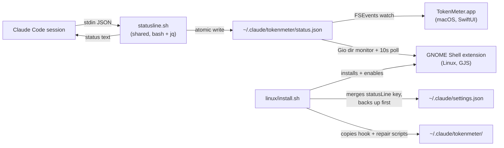

# TokenMeter — Linux Support Design Spec

Date: 2026-08-26
Status: Approved
Extends: [2026-08-17-tokenmeter-design.md](2026-08-17-tokenmeter-design.md)

## Purpose

Bring TokenMeter to Linux with the same product shape as the macOS
version: an always-visible "5h 42%" readout with a dropdown showing both
rate-limit windows. The data pipeline (Claude Code `statusLine` hook →
`status.json` → watching UI) is unchanged and shared; only the UI layer
and installer are platform-specific.

## Platform decision

The macOS UI is SwiftUI (`MenuBarExtra`), which does not exist on Linux,
and this port targets machines without a Swift toolchain. The natural
Linux analog of a menu bar app depends on the desktop environment:

| Option | Verdict |
|---|---|
| GNOME Shell extension (JS) | **Chosen.** Native top-bar text + popup menu, works on Wayland, zero new runtime dependencies (GJS ships with GNOME), no separate daemon — the shell renders it. |
| AppIndicator tray app (Python/GTK) | Needs extra GI packages, label support varies by DE, runs as its own process. |
| Port Swift app to GTK | Heavy toolchain requirement, immature bindings, still no tray text on GNOME. |
| Waybar/Polybar module | Niche; GNOME users (the default on Ubuntu/Fedora) get nothing. |

Non-GNOME desktops still get the terminal status line (the hook is
UI-independent); the installer detects this and says so.

## Architecture

## Components

1. **`Resources/statusline.sh`** (shared, now portable)
   - Same extraction logic on both platforms; only bash + `jq` + POSIX
     tools. `LC_ALL=C` pins float parsing against locale decimal commas.
   - Hardened: creates `~/.claude/tokenmeter` as `700` and writes
     `status.json` as `600` (the directory also stores settings.json
     backups, which can contain secrets).

2. **GNOME Shell extension** (`linux/gnome-extension/tokenmeter@sh4r11f.github.io/`)
   - `lib.js`: pure port of `StatusFileStore` classification +
     `LabelFormatter` (thresholds ≥50% warning, >80% critical; staleness
     >120s; most-urgent tie goes to 5-hour). No GNOME imports, so
     `gjs -m linux/tests/test-lib.js` unit-tests it headlessly.
   - `extension.js`: `PanelMenu.Button` with icon + colored label;
     popup with per-window detail, metric radio submenu, "Repair hook"
     (re-runs the installed hook installer via fixed-argv subprocess),
     and Preferences. Watches the tokenmeter *directory* (atomic `mv`
     shows up reliably there) plus a 10s poll that also re-evaluates
     staleness. `disable()` tears everything down per EGO review rules.
   - `prefs.js`: Adw window with the label-metric choice, stored in a
     bundled GSettings schema (`org.gnome.shell.extensions.tokenmeter`).
   - Supported: GNOME Shell 48–50 (ESM extension API).

3. **Installer** (`linux/install.sh` → `linux/install-hook.sh`)
   - `install-hook.sh` is the bash+jq port of `SettingsInstaller` with
     identical semantics: preserve unrelated keys, timestamped backup
     before any modification, wrap (never overwrite) a pre-existing
     statusLine command using the same `'\''` quoting, abort loudly on
     malformed JSON, idempotent re-runs, symlink-resolving writes.
   - `install.sh` copies `statusline.sh` + `install-hook.sh` +
     `uninstall.sh` into `~/.claude/tokenmeter/` (so repair/uninstall
     survive deleting the repo checkout), runs the hook installer, then
     installs and enables the extension. On Wayland a brand-new
     extension only loads at login; the installer marks it enabled in
     gsettings and tells the user to log out/in once.
   - No sudo, no network access, `$HOME` only.

4. **Uninstaller** (`linux/uninstall.sh`)
   - Deliberately *better* than "restore latest backup": surgically
     unwraps/removes only the statusLine entry (restoring a wrapped
     original command exactly), so settings changes made after install
     are never reverted. Backs up before touching the file anyway.
   - Extension disabled + removed; the data directory (snapshots and
     backups) is deleted only with `--purge` or explicit confirmation.

## Error handling

Same policy as the original design, applied to the new pieces:

- `statusline.sh` never breaks the status line: capture failures go to
  stderr, stdout always carries the best available status text.
- Installer aborts (exit ≠ 0, clear message, file untouched) on
  malformed `settings.json`; it never deletes the original.
- Extension: a failed directory monitor logs a warning and falls back to
  polling; a missing repair script produces a desktop notification with
  the fix, not silence.

## Security / privacy properties

- **No network I/O anywhere** — hook, installer, and extension only
  touch files under `$HOME`.
- **No secrets read**: only `rate_limits` is extracted from the hook
  payload; the full payload is never persisted.
- `~/.claude/tokenmeter` is `700`; `settings.json` backups are `600`
  (they are verbatim copies and can contain API-key env vars); a newly
  created `settings.json` is `600`, and an existing one keeps its mode.
- The wrapped pre-existing command runs with the user's own privileges,
  exactly as it already did as the user's own statusLine hook.
- "Repair hook" spawns `bash ~/.claude/tokenmeter/install-hook.sh` with
  a fixed argv — no shell string interpolation of any runtime value.

## Testing

- `scripts/test-statusline.sh` (shared): fixture payloads, separator
  regression, permission assertions — portable `stat` for both OSes.
- `linux/test-install.sh`: install/wrap/unwrap/idempotence/malformed/
  symlink cases in throwaway fake `$HOME`s, with `gjs`/`gnome-extensions`
  stubbed so tests can never touch real GNOME settings.
- `linux/tests/test-lib.js` under `gjs -m`: every `LabelFormatter` port
  branch (37 assertions mirroring the Swift tests).
- `linux/test-extension.sh`: metadata/uuid/schema consistency, strict
  gschema compilation, and a syntax lint of the shell-dependent JS.
- CI: new `linux-test` job on `ubuntu-latest` alongside the existing
  macOS job.

## Out of scope (YAGNI)

- KDE/other tray implementations (the hook already works there;
  contributions welcome).
- extensions.gnome.org packaging/review submission.
- Swift-on-Linux builds of TokenMeterCore.
